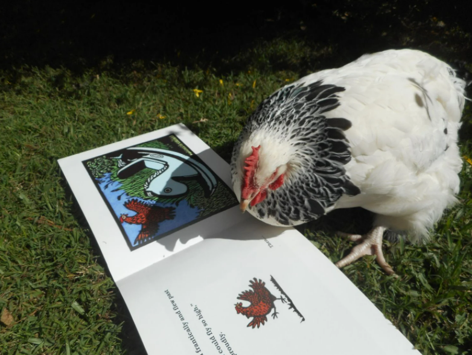
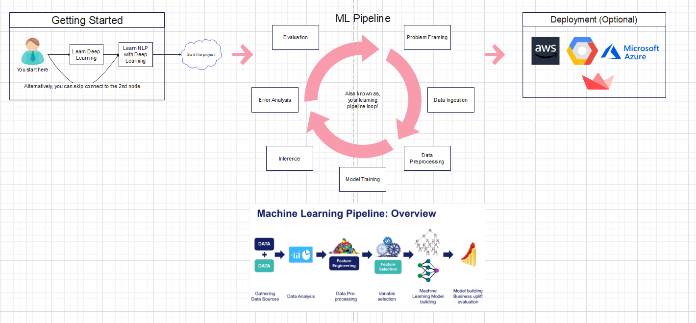

# The Getting Started Kit
provided by Vincent

Table of Contents:  
    
<ul>
    <li>1. <a href="">Introduction</a></li>
    <li>2. <a href="">Roadmap</a>
        <ul>
            <li>2.1. <a href="">Getting Started</a></li>
            <li>2.2. <a href="">ML Pipeline</a></li>
            <li>2.3. <a href="">Deployment (Optional)</a></li>
        </ul>
    </li>
    <li>3. <a href="">Resources</a></li>
    <li>4. <a href="">Advice</a></li>
    <li>5. <a href="">Ending Note</a></li>
</ul>

# 1. Introduction 👋

Alright, here's the introduction. I'm not exactly sure where you stand, but I can try to cover as much breadth as possible in this document. And hopefully it helps. This spaghetti is pretty good. Anyways. Starting out, especially diving into a topic like this can be extremely _convoluted_ (convolution pun). There's a ton to watch out for. What tutorial do I watch? What do I need to learn? How does everything fit together? I hope to answer all of these questions and more in this document. This introduction is really messy. You're still reading this. HAHA. In short, I provide you a project roadmap, resources for each stage in that project roadmap, general advice, and lastly, a small note from me. The rest of this page will be formal and informative!

# 2. Roadmap 🚧

  
Figure 1. A Roadmap of the project workflow.

## 2.1. Getting Started

Getting started is simple! Team Chiken's strong foundations seem to expediate the traditional break into Machine Learning and Deep Learning. We can immediately start brushing up on deep learning. And for those who claim to have a strong foundation, they can immediately get started on exploring deep learning's application in __Natural Language Processing (NLP)__. 

⏰ __Time estimate__: 2-3 weeks

## 2.2. ML Pipeline

The ML Pipeline is the core of our team (why we are an AI team). The majority of our time together as a team will be spent traversing this non-sequential loop (the loop is mostly sequential, but alterations can occur). In Figure 1, I've included both an illustrative snapshot of the ML pipeline as well as a loop (to imply that learning is continuous).

⏰ __Time estimate__: rest of quarter

## 2.3. Deployment (Optional)

I included deployment here because it is within the the interests of our team to implement an AI-embedded application that serves a purpose. However, this is definitely optional.

⏰ __Time estimate__: 2-3 weeks

# 3. Resources 📘

📌 __Note__: The following list is not comprehensive and are only suited for deep learning and deep NLP.

Deep Learning:

- [Deep Learning Crash Course for Beginners
](https://www.youtube.com/watch?v=VyWAvY2CF9c) by freeCodeCamp covers just the conceptual basics of deep neural networks.
- [Keras with TensorFlow Course - Python Deep Learning and Neural Networks for Beginners Tutorial
](https://www.youtube.com/watch?v=qFJeN9V1ZsI&t=3811s) by deeplizard provided by freeCodeCamp covers deep learning with a concentration on computer vision models. It focuses on practical implementation (with TensorFlow and Keras) rather than math.
- [Introduction | Deep Learning Tutorial 1 (Tensorflow Tutorial, Keras & Python)
](https://www.youtube.com/watch?v=Mubj_fqiAv8&list=PLeo1K3hjS3uu7CxAacxVndI4bE_o3BDtO) by codebasics covers a myriad of topics, covering concepts and their implementations in TensorFlow and Keras.
- [TensorFlow 2.0 Complete Course - Python Neural Networks for Beginners Tutorial
](https://www.youtube.com/watch?v=tPYj3fFJGjk&t=21s) by TechWithTim provided by freeCodeCamp briefly covers concepts while focusing mainly on the code implementation in TensorFlow and Keras.
- [Hands-On Machine Learning with Scikit-Learn, Keras, and TensorFlow](https://drive.google.com/drive/folders/1Cf4wpLLBomt-V6HDScNnOYLDfarcjjyZ) by Aurélien Géron is a comprehensive book for breaking into machine learning and deep learning. Part II of the book covers deep learning with TensorFlow and Keras.
- [PyTorch Tutorials](https://www.youtube.com/watch?v=2S1dgHpqCdk&list=PLhhyoLH6IjfxeoooqP9rhU3HJIAVAJ3Vz) by Aladdin Persson offers a code-centric guide to learning deep learning with the PyTorch framework.

I assume all of us have had some experience with deep learning. For those who are a bit rusty, definitely check out deeplizard's channel (which covers both code and concepts). 

Deep Learning in NLP:

- [DEEP LEARNING FOR NLP WITH PYTORCH](https://pytorch.org/tutorials/beginner/deep_learning_nlp_tutorial.html) by PyTorch offers examples of NLP in practice. I would not advise thoroughly going through these as they aren't suited for introduction.
- [Text classification with an RNN](https://www.tensorflow.org/text/tutorials/text_classification_rnn) provided by the TensorFlow documentation is a good starting point for beginners who are setting foot in deep NLP.
- [Hands-On Machine Learning with Scikit-Learn, Keras, and TensorFlow](https://drive.google.com/drive/folders/1Cf4wpLLBomt-V6HDScNnOYLDfarcjjyZ) by Aurélien Géron is included here again as chapters 15 and 16 offer a comprehensive beginner's guide to deep NLP. 

For NLP, I suggest reading chapters 15 and 16 in Aurélien Géron's book as they offer the clearest introduction. 

# 4. Advice 🤔

- Toy with the code. Experiment with it and see how it works.
- If you read Aurélien Géron's book (chapters 15 and 16 or the entire deep learning section), I advise you to do the exercises and organize your code in this repo!
- Tutorial hell is a commonly thrown around phrase describing the difficulties of the wealth of tutorials available to you. Some are confusing. Sometimes there are too many. Some are not comprehensive. Some don't include the information you want. Sometimes there are too many tutorials and it seems as if your progression has been halted. My advice is simply to pick a reliable source. Stick with it. Navigate through other tutorials if needed, but look elsewhere to learn more once you have mastered your fundamentals.
- Don't get discouraged! NLP as with any field is not easy. The initial introduction will always be overwhelming. However, with time, this feeling decays. 
- Start small and work your way up. Start by learning the basics, implementing basic projects. Then, once you've grown comfortable with this cycle, upgrade to more advanced knowledge until you are ready to tackle your project. 

# 5. Ending Note 👋

Alright, I've spent like 2 hours on this document. Hopefully you found it helpful! Do keep in mind everything I provided above (roadmap, resources, advice) is not comprehensive. They are all simply subsets of a larger picture. But for a project like this, I think they are enough for a good starting point. Thanks for reading this and I'm looking forward to working with you guys on this project!